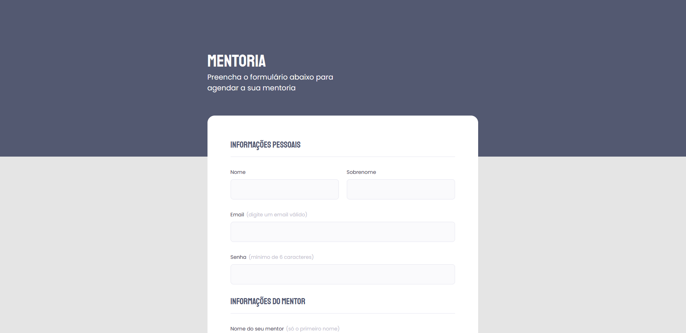

<h1 align="center"> Formulário de Mentoria </h1>

  <a href="#-tecnologias">Tecnologias</a>&nbsp;&nbsp;&nbsp;|&nbsp;&nbsp;&nbsp;
  <a href="#-projeto">Projeto</a>&nbsp;&nbsp;&nbsp;|&nbsp;&nbsp;&nbsp;
  <a href="#-layout">Layout</a>

 

  

## 🚀 Tecnologias

Esse projeto foi desenvolvido com as seguintes tecnologias:

- HTML e CSS
- Git e Github

## 💻 Projeto

Este formulário para agendamento de mentoria foi desenvolvido como Desafio do Stage 03 do curso Explorer da Rocketseat para aprendizado de tags de formulário e CSS.

Você pode visualizar o projeto através [DESSE LINK](https://viviansanchez.github.io/rocketseat-explorer-stage03-desafio01/)!

## 🔖 Layout

Você pode visualizar o layout do projeto através [DESSE LINK](https://www.figma.com/file/Nws1KWB7DyXBw8L6wXb9mp/Stage-03---Formul%C3%A1rio-intermedi%C3%A1rio/duplicate). É necessário ter conta no [Figma](https://figma.com) para acessá-lo.
